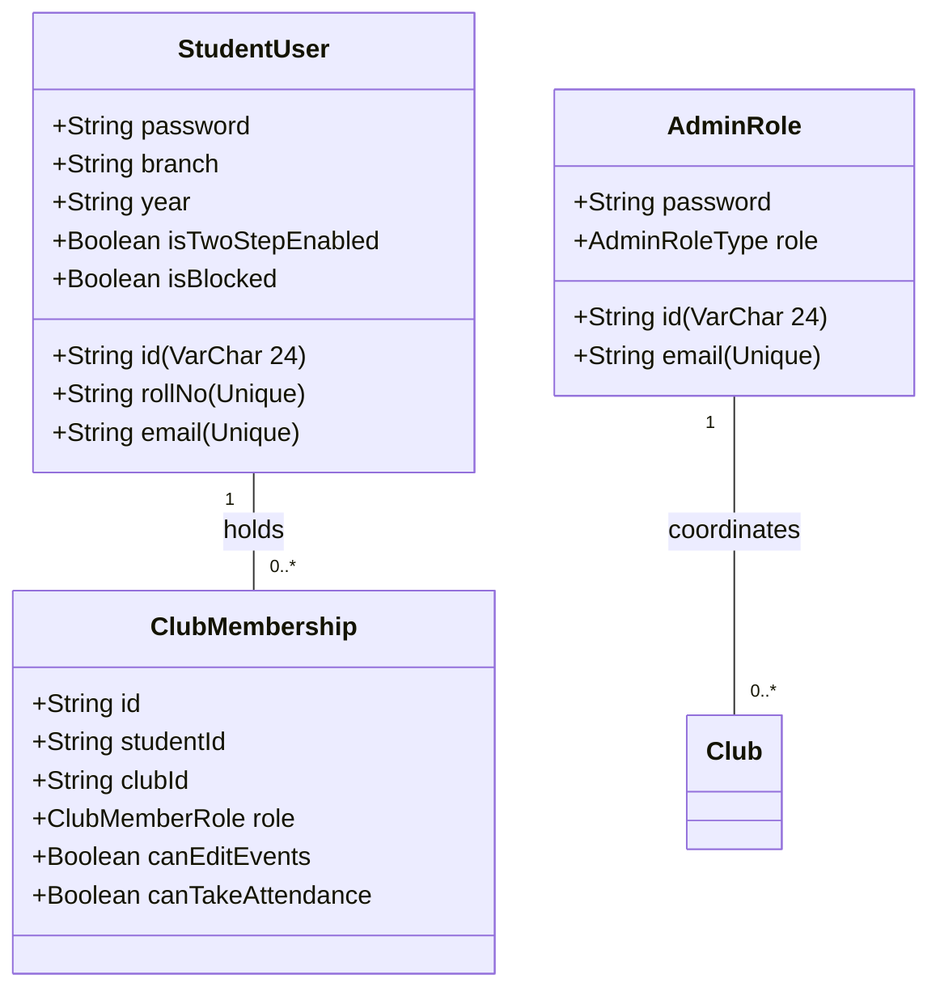
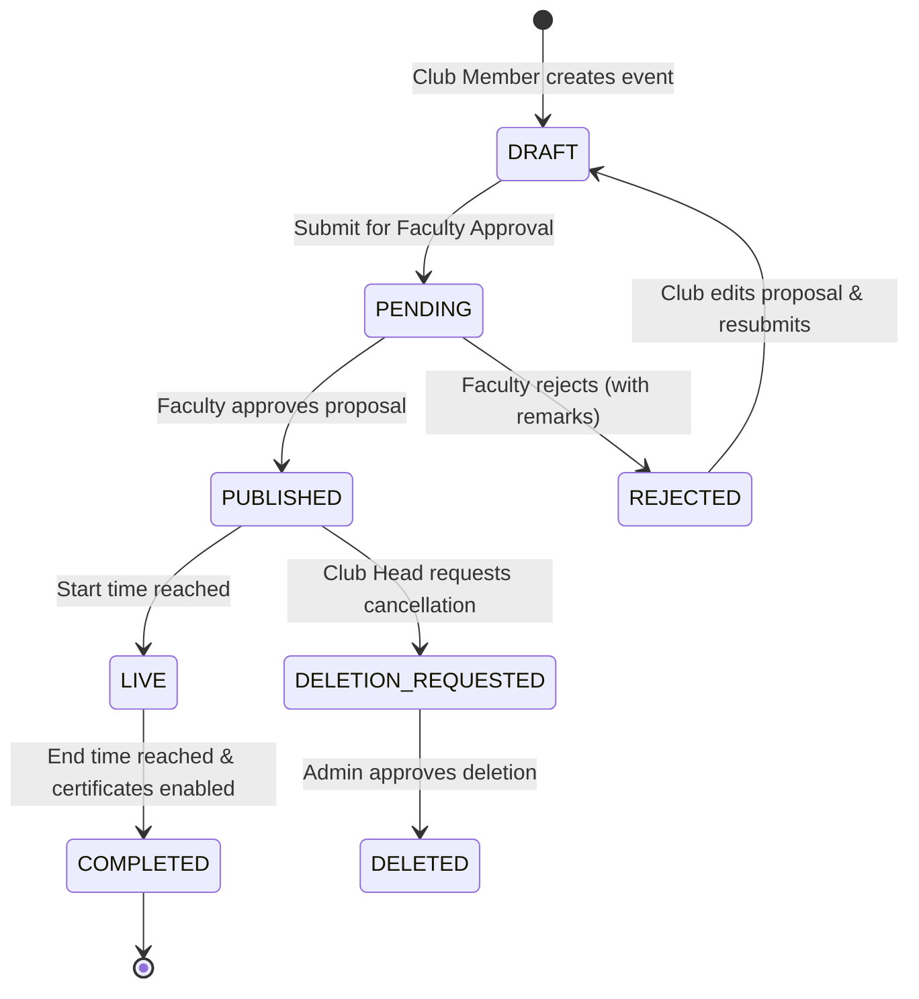
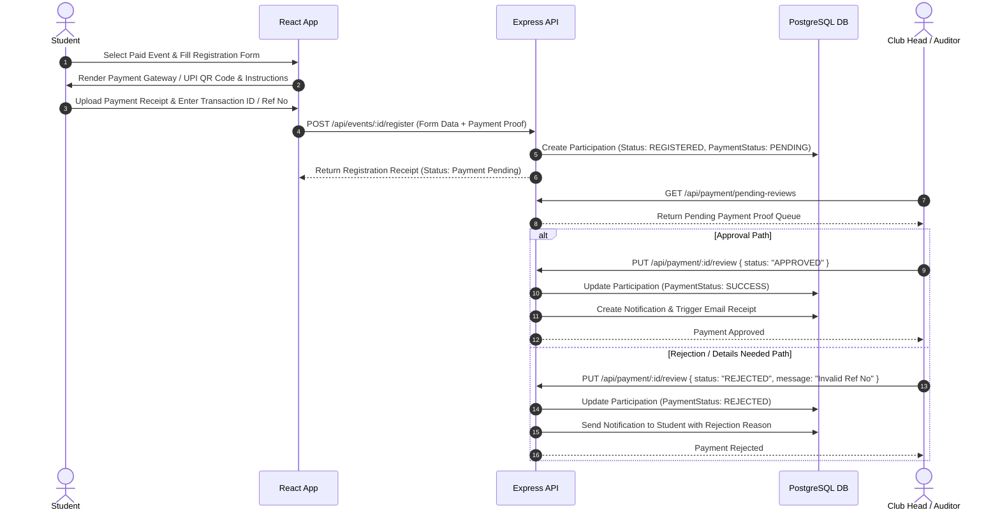
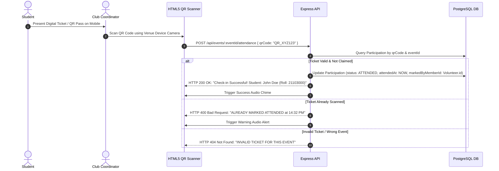

# 📄 CampusNode (ClubSetu) — Comprehensive Technical Specification & System Architecture

> **Document Type:** Technical System Architecture & Developer Manual  
> **Target Audience:** Engineering Leads, System Architects, Technical Evaluators, Departmental IT Administration  
> **System Version:** v1.0.0-production  
> **Date:** August 2026  
> **Status:** Fully Implemented & Deployed  

---

## 📌 Executive Table of Contents
1. [CampusNode Overview](#1-campusnode-overview)
2. [System Architecture](#2-system-architecture)
3. [Technologies Used](#3-technologies-used)
   - [3.1 Frontend Stack](#31-frontend-stack)
   - [3.2 Backend Stack](#32-backend-stack)
   - [3.3 Database Architecture](#33-database-architecture)
4. [Authentication & Role-Based Access Control (RBAC)](#4-authentication--role-based-access-control-rbac)
   - [4.1 Authentication Mechanisms](#41-authentication-mechanisms)
   - [4.2 Identity Models](#42-identity-models)
   - [4.3 RBAC Hierarchy & Permissions](#43-rbac-hierarchy--permissions)
5. [Major System Modules](#5-major-system-modules)
6. [Role-Wise Feature Matrix](#6-role-wise-feature-matrix)
7. [Event Lifecycle State Machine](#7-event-lifecycle-state-machine)
8. [Payment & Settlement Workflow](#8-payment--settlement-workflow)
9. [Attendance & Verification Workflow](#9-attendance--verification-workflow)
10. [Automated Certificate Engine Workflow](#10-automated-certificate-engine-workflow)
11. [Multi-Tier Notification System](#11-multi-tier-notification-system)
12. [Security & Access Control Mechanisms](#12-security--access-control-mechanisms)
13. [Deployment Architecture](#13-deployment-architecture)
14. [Testing & Quality Assurance Status](#14-testing--quality-assurance-status)
15. [Known System Limitations](#15-known-system-limitations)
16. [Future Enhancement Scope](#16-future-enhancement-scope)

---

## 1. CampusNode Overview

CampusNode (internally **ClubSetu**) is an enterprise-grade, full-stack campus event lifecycle and student activity management platform. Designed specifically for higher education institutions, student societies, and university administration, CampusNode solves the systemic fragmentation inherent in manual campus administration (e.g., disparate Google Forms, unverified WhatsApp broadcasts, manual paper check-ins, and untracked fee receipts).

### 1.1 Problem Statement Addressed
- **Information Fragmentation**: Students miss critical events due to decentralized communication across unofficial social media channels.
- **Registration Overflows & Fake Identities**: Lack of real-time seat capping, duplicate roll-number submissions, and unauthorized non-institutional entries.
- **Manual Attendance Verification**: Queue congestion at venues during paper-based roll calls or manual spreadsheet markups.
- **Financial Audit Risk**: Unverified direct UPI transfers and lack of centralized payment logs for paid workshops/competitions.
- **Certificate Counterfeiting & Administrative Overhead**: Manual designing, printing, signing, and emailing of participation certificates.
- **Unregulated Campus Lost & Found**: No verified accountability for lost student property across campus premises.

### 1.2 Core Solution Architecture
CampusNode introduces an integrated digital ecosystem:
- **Centralized Event Portal**: Searchable, filterable directory with custom dynamic form engine per event.
- **Decentralized Club Operations**: Role-scoped tools for club executives to build events, verify receipts, and issue tickets.
- **Institutional Governance**: Multi-stage approval gates requiring Faculty Coordinator clearance before event publication.
- **Cryptographic QR Check-in**: High-throughput mobile/web QR ticket scanner for instant entry verification.
- **Automated Vector PDF Engine**: On-the-fly certificate generation using custom coordinate-mapped background templates.
- **Audited Financial Workflow**: Dual-key payment review queue for manual and digital transaction verifications.
- **Moderated Lost & Found Board**: Campus-wide reporting system with fraud flags and claim resolution logs.

---

## 2. System Architecture

CampusNode follows a **Decoupled Client-Server Multi-Tier Architecture**. The system separates the user interface layer (Single-Page React Application) from the underlying application backend (RESTful Express API Server & WebSockets Engine) and persistent data store (PostgreSQL via Prisma ORM).

### 2.1 High-Level Architectural Diagram

```text
┌─────────────────────────────────────────────────────────────────────────────────┐
│                              CLIENT PRESENTATION TIER                           │
│  ┌───────────────────────────────────────────────────────────────────────────┐  │
│  │                    Vite + React 19 SPA (Client UI)                        │  │
│  │   • Tailwind CSS v4 / Framer Motion     • HTML5 QR Scanner                │  │
│  │   • React Router v7 Navigation          • Axios Interceptors              │  │
│  │   • Socket.io Client (Real-Time Alerts) • Dynamic Event Form Builder        │  │
│  └─────────────────────────────────────┬─────────────────────────────────────┘  │
└────────────────────────────────────────┼────────────────────────────────────────┘
                                         │ HTTPS REST API / WSS WebSockets
┌────────────────────────────────────────▼────────────────────────────────────────┐
│                              APPLICATION SERVER TIER                            │
│  ┌───────────────────────────────────────────────────────────────────────────┐  │
│  │                   Node.js 22 + Express 5 API Gateway                      │  │
│  │  ┌────────────────────────┐  ┌──────────────────────┐  ┌────────────────┐ │  │
│  │  │ Security & Middlewares │  │ Controller Logic     │  │ Engine Modules │ │  │
│  │  │ • Helmet Security      │  │ • Auth & User API    │  │ • PDFKit Engine│ │  │
│  │  │ • Express Rate Limiter │  │ • Event Lifecycle    │  │ • Mailer (Resend│  │
│  │  │ • JWT Auth Guard       │  │ • Payment Review API │  │   / SMTP)      │ │  │
│  │  │ • Statutory RBAC Guard │  │ • Team Builder API   │  │ • Socket.io    │ │  │
│  │  │ • Zod Payload Validator│  │ • Lost & Found API   │  │   Notifier     │ │  │
│  │  └────────────────────────┘  └──────────────────────┘  └────────────────┘ │  │
│  └─────────────────────────────────────┬─────────────────────────────────────┘  │
└────────────────────────────────────────┼────────────────────────────────────────┘
                                         │ TCP Connection Pool / SDK API
       ┌─────────────────────────────────┼─────────────────────────────────┐
       │                                 │                                 │
┌──────▼──────────────────────────┐ ┌────▼──────────────────────────┐ ┌────▼──────────────┐
│       DATABASE TIER             │ │       MEDIA CDN TIER          │ │  TRANSACTIONAL MAIL│
│ ┌─────────────────────────────┐ │ │ ┌───────────────────────────┐ │ │ ┌──────────────┐ │
│ │ PostgreSQL 16 Database      │ │ │ │ Cloudinary CDN Storage    │ │ │ │ SMTP / Resend│ │
│ │ • Prisma ORM 7 Data Access  │ │ │ │ • Event Banners & Logos   │ │ │ │ • OTP / 2FA  │ │
│ │ • Relational Constraints    │ │ │ │ • Lost & Found Photographs│ │ │ │ • Tickets    │ │
│ │ • B-Tree Indexes & Enums    │ │ │ │ • Certificate Templates   │ │ │ │ • Approvals  │ │
│ └─────────────────────────────┘ │ │ └───────────────────────────┘ │ │ └──────────────┘ │
└─────────────────────────────────┘ └───────────────────────────────┘ └──────────────────┘
```

### 2.2 Component Interaction Breakdown
1. **HTTP/REST Ingress**: All API calls pass through Express rate limiters, Helmet security header injection, and JWT validation.
2. **Real-Time Websocket Pipeline**: Socket.io handles active bidirectional sockets. Broadcast alerts (e.g., event approvals, ticket confirmations) bypass HTTP polling.
3. **ORM Data Layer**: Prisma ORM executes typed parameterized SQL queries against PostgreSQL, managing transactional boundaries (`prisma.$transaction`) during financial reviews and seat increments.
4. **Media Asset Pipeline**: Multer buffers uploaded files in-memory before sending them to Cloudinary CDN, returning secure HTTPS URLs persisted in the database.

---

## 3. Technologies Used

### 3.1 Frontend Stack
- **Core Runtime & Framework**: React 19 (`react`, `react-dom`) bundled with Vite 7 (`vite`).
- **Routing Engine**: React Router v7 (`react-router-dom`) with client-side code splitting and route guards.
- **Styling Architecture**: Tailwind CSS v4 (`@tailwindcss/vite`), utility-first responsive layout engine.
- **Iconography & Visuals**: Lucide React (`lucide-react`), Remixicon (`remixicon`), and Radix UI primitives.
- **Animation Framework**: Framer Motion (`framer-motion`) for micro-interactions and transitions.
- **HTTP Client**: Axios (`axios`) configured with request authorization interceptors and central response error handlers.
- **Hardware Integration**: HTML5 QR Code (`html5-qrcode`) for camera-based venue scanning.
- **Sanitization & Security**: DOMPurify (`dompurify`) to mitigate DOM-based XSS vulnerability during rich text rendering.
- **Feedback & Toasts**: React Hot Toast (`react-hot-toast`).

### 3.2 Backend Stack
- **Runtime Environment**: Node.js v22 (LTS).
- **Web Application Framework**: Express.js 5 (`express`).
- **Real-Time Engine**: Socket.io (`socket.io`) supporting CORS-configured WebSocket server.
- **ORM & Database Driver**: Prisma ORM 7 (`@prisma/client`, `prisma`).
- **Authentication & Cryptography**:
  - `jsonwebtoken`: Stateless RSA/HMAC signed access tokens.
  - `bcryptjs`: Password hashing using salt rounds = 10.
  - `speakeasy` / `qrcode`: Time-based OTP (2FA) verification routines.
- **PDF Generation Engine**: PDFKit (`pdfkit`) vector document builder for dynamic certificate rendering.
- **Email Delivery Service**: Nodemailer (`nodemailer`) & Resend API SDK (`resend`).
- **File Processing & Cloud Storage**: Cloudinary SDK (`cloudinary`) with Multer (`multer`) memory storage middleware.
- **Security & Optimization**: Helmet (`helmet`), Express Rate Limit (`express-rate-limit`), CORS (`cors`), Compression (`compression`).

### 3.3 Database Architecture
- **DBMS**: PostgreSQL 16 (Enterprise Relational Database).
- **Data Access Pattern**: Prisma Client using parameterized queries to enforce strict data types, foreign key cascades, and unique constraints.
- **Key Indexing Strategy**:
  - `Event`: Composite index on `[clubId, startTime]`, `[reviewStatus, startTime]`, `[createdById, startTime]`.
  - `Participation`: Composite index on `[studentId, eventId]`, `[eventId, paymentStatus]`, `[eventId, status]`.
  - `LostFoundItem`: Composite index on `[userId, createdAt]`, `[status, createdAt]`.
  - `Notification`: Index on `[recipientStudentId, createdAt]`, `[eventId, createdAt]`.

---

## 4. Authentication & Role-Based Access Control (RBAC)

### 4.1 Authentication Mechanisms
1. **Stateless JWT Tokens**: Upon successful authentication, the server issues a signed JSON Web Token containing `{ userId, email, role }`. The client sends this token in the `Authorization: Bearer <token>` HTTP header.
2. **Two-Factor Authentication (2FA / OTP)**: Supports email OTP and time-based OTP setup (`isTwoStepEnabled: true`). Login flows issue a transient OTP token before granting full access.
3. **Account Recovery**: Password reset flows use cryptographically random tokens stored with expiry timestamps (`resetPasswordToken`, `resetPasswordExpire`).

### 4.2 Identity Models
To separate student data from system administrative capabilities, CampusNode uses two distinct underlying identity tables:

1. **`StudentUser`**: Represents all enrolled students. Can be a normal attendee or a member/lead of one or more clubs via `ClubMembership`.
2. **`AdminRole`**: Represents institutional administrators and faculty members with elevated site-wide powers.



### 4.3 RBAC Hierarchy & Permissions

#### System Roles (`AdminRoleType` Enum)
- `admin`: Super Administrator. Global system overrides, club provisioning, role assignments, global analytics.
- `facultyCoordinator`: Lead Faculty supervisor assigned to a specific club. Event proposal reviewer, financial oversight.
- `paymentAdmin`: Dedicated financial auditor. Can review and override payments across institutional accounts.
- `lostFoundAdmin`: Campus security moderator. Resolves fraud disputes and clears obsolete Lost & Found posts.

#### Club Member Roles (`ClubMemberRole` Enum)
- `CLUB_HEAD`: Executive lead of a club. Full access to create events, manage club profiles, assign team permissions, and review payments.
- `COORDINATOR`: Senior club member. Event creation permissions, attendee verification, and attendance check-in capabilities.
- `MEMBER`: General team member. Granted explicit boolean privileges (`canEditEvents`, `canTakeAttendance`).

#### General User Role
- `student`: Standard student account. Can register for events, form hackathon teams, report lost/found items, and download certificates.

---

## 5. Major System Modules

```text
┌─────────────────────────────────────────────────────────────────────────────────┐
│                             CAMPUSNODE MAJOR MODULES                            │
├───────────────────┬───────────────────┬───────────────────┬─────────────────────┤
│ 1. Student Portal │ 2. Club Builder   │ 3. Governance     │ 4. Verification     │
│   • Discovery     │   • Event Builder │   • Approval Flow │   • QR Check-in     │
│   • Registration  │   • Dynamic Forms │   • Club Provision│   • Payment Review  │
│   • Team Formation│   • Member Roles  │   • System Logs   │   • Cert Engine     │
├───────────────────┴───────────────────┴───────────────────┴─────────────────────┤
│ 5. Campus Lost & Found    │ 6. Real-Time Notifications  │ 7. Audit & Analytics│
│   • Claim Workflow        │   • WebSockets Broadcasts   │   • Financial Logs  │
│   • Fraud Prevention      │   • Transactional Emails    │   • Export (CSV/PDF)│
└───────────────────────────┴─────────────────────────────┴─────────────────────┘
```

1. **Student Event & Team Portal**: Browse events with dynamic filter parameters (category, club, date). Form multi-member teams for hackathons with join-code invitations.
2. **Club Operations & Event Builder**: Custom event constructor allowing clubs to specify capacity caps, branch/year restrictions, dynamic inputs (T-shirt sizes, portfolio links, file attachments), and entry fee modes.
3. **Faculty & Admin Governance Portal**: Approval queue where Faculty Coordinators review event drafts (`DRAFT` → `PENDING` → `PUBLISHED` or `REJECTED`) with rejection comments.
4. **Attendance & Verification Engine**: Scanner interface enabling club coordinators to scan QR codes on student tickets to validate authenticity and mark physical attendance.
5. **Automated Certificate Engine**: Dynamic visual layout engine overlaying student names, roll numbers, and event titles onto uploaded certificate templates using PDFKit.
6. **Campus Lost & Found Board**: Moderated listing platform with image attachments, claim resolution flows, reporter accountability, and administrative flag moderation.
7. **Financial Audit & Payment Review Queue**: Dual-pass ledger for events collecting fees via direct UPI or institutional gateways, complete with transaction ID validation and proof review.

---

## 6. Role-Wise Feature Matrix

| Feature / Action | Student | Club Member | Club Coordinator | Club Head | Faculty Coordinator | Payment Admin | System Admin |
| :--- | :---: | :---: | :---: | :---: | :---: | :---: | :---: |
| **Browse & Register Events** | ✅ | ✅ | ✅ | ✅ | 👁️ Read | 👁️ Read | ✅ |
| **Form/Join Competition Teams** | ✅ | ✅ | ✅ | ✅ | ❌ | ❌ | ✅ |
| **Create Event Drafts** | ❌ | Explicit | ✅ | ✅ | ❌ | ❌ | ✅ |
| **Publish Event Directly** | ❌ | ❌ | ❌ | ❌ | ✅ | ❌ | ✅ |
| **Approve / Reject Event Proposals** | ❌ | ❌ | ❌ | ❌ | ✅ (Assigned Club)| ❌ | ✅ |
| **Scan Venue QR Attendance** | ❌ | Explicit | ✅ | ✅ | 👁️ View Stats | ❌ | ✅ |
| **Review Manual Payment Proofs** | ❌ | ❌ | ✅ | ✅ | 👁️ View Audit | ✅ | ✅ |
| **Configure Certificate Templates**| ❌ | ❌ | ✅ | ✅ | 👁️ Preview | ❌ | ✅ |
| **Issue / Download Certificates** | ✅ (Own) | ✅ (Own) | ✅ (Own) | ✅ (Export) | 👁️ Audit | ❌ | ✅ |
| **Post Lost & Found Listings** | ✅ | ✅ | ✅ | ✅ | ✅ | ✅ | ✅ |
| **Moderate / Delete Fraud Posts** | ❌ | ❌ | ❌ | ❌ | ❌ | ❌ | ✅ (LostFoundAdmin)|
| **Provision New Clubs** | ❌ | ❌ | ❌ | ❌ | ❌ | ❌ | ✅ |
| **System-Wide Analytics & Export** | ❌ | ❌ | ❌ | 👁️ Club Only | 👁️ Club Only | 👁️ Payments | ✅ Global |

---

## 7. Event Lifecycle State Machine

Events undergo strict state transitions enforced by the Express API layer. Unauthorized status mutations are blocked with HTTP 403 Forbidden responses.



### State Transition Breakdown
1. `DRAFT`: Created by club coordinators. Editable by authorized club members. Not visible on public student feed.
2. `PENDING`: Proposal submitted. Locked for editing by club. Awaiting Faculty Coordinator review in governance portal.
3. `REJECTED`: Proposal rejected by Faculty Coordinator. Returned to `DRAFT` state with reviewer feedback comments (`reviewComment`).
4. `PUBLISHED`: Approved by Faculty Coordinator. Visible on student portal; dynamic registration form active.
5. `DELETION_REQUESTED`: Club requests event cancellation post-publication. Requires Administrative clearance to purge registrations.

---

## 8. Payment & Settlement Workflow

CampusNode supports both **Free Events** (`entryFee = 0`) and **Paid Events** (`entryFee > 0`). For paid events, the system provides a robust financial verification queue handling direct UPI uploads and college portal validation.



### Payment Handling Protocols
- **Duplicate Prevention**: Transaction IDs (`transactionId`) are verified against existing participation records to block re-use of reference numbers.
- **Seat Reservation Control**: Pending registrations hold seats transiently. If a payment is marked `REJECTED`, the seat count increment is reverted.
- **Financial Audit Log**: Every review action records `paymentReviewedBy` (User ID) and `paymentReviewedAt` (Timestamp) for auditing.

---

## 9. Attendance & Verification Workflow

Attendance verification relies on cryptographic, single-use QR ticket passes issued to verified registered students.



### Technical Specs for Attendance Engine
- **QR Token Encoding**: Format: `CN-ATT-{participationId}-{eventIdHash}`.
- **Throughput Optimization**: Attendance API response time is under 45ms using indexed B-Tree lookups on `Participation.qrCode`.
- **Double-Scan Prevention**: Atomic database state check ensures a ticket cannot be checked in twice.
- **Real-Time Venue Counter**: Emits Socket.io `ATTENDANCE_MARKED` event to update live venue dashboard UI.

---

## 10. Automated Certificate Engine Workflow

CampusNode eliminates manual certificate creation using an automated vector rendering pipeline powered by PDFKit.

```text
┌─────────────────────────────────────────────────────────────────────────────────┐
│                          CERTIFICATE ENGINE ARCHITECTURE                        │
│                                                                                 │
│ 1. Template Configurator (Club Head UI)                                         │
│   ┌─────────────────────────────────────────────────────────────────────────┐   │
│   │ Upload High-Res Background (PNG/JPG) -> Cloudinary                      │   │
│   │ Define Coordinates (JSON):                                             │   │
│   │ {                                                                       │   │
│   │   "studentName": { "x": 400, "y": 280, "fontSize": 28, "color": "#000" }, │   │
│   │   "eventTitle":  { "x": 400, "y": 360, "fontSize": 20, "color": "#444" }, │   │
│   │   "issueDate":   { "x": 150, "y": 500, "fontSize": 14, "color": "#666" }  │   │
│   │ }                                                                       │   │
│   └────────────────────────────────────┬────────────────────────────────────┘   │
│                                        │                                        │
│ 2. Trigger Event (Student Dashboard / Batch Issuance)                           │
│   ┌────────────────────────────────────▼────────────────────────────────────┐   │
│   │ Verify Condition: Participation.status === "ATTENDED"                   │   │
│   │ Verify Condition: Event.provideCertificate === true                     │   │
│   └────────────────────────────────────┬────────────────────────────────────┘   │
│                                        │                                        │
│ 3. PDFKit Dynamic Rendering Pipeline                                            │
│   ┌────────────────────────────────────▼────────────────────────────────────┐   │
│   │ Fetch Background Image Buffer from CDN                                  │   │
│   │ Instantiate PDFDocument({ size: 'A4', layout: 'landscape' })            │   │
│   │ Composite Background Image -> Draw Vector Text Overlays                 │   │
│   │ Stream PDF Binary Buffer -> Client Download / HTTP Attachment           │   │
│   └─────────────────────────────────────────────────────────────────────────┘   │
└─────────────────────────────────────────────────────────────────────────────────┘
```

---

## 11. Multi-Tier Notification System

The notification framework uses a three-tier push model to guarantee delivery of critical alerts.

```text
                                 ┌────────────────────────┐
                                 │ Trigger Event Occurs   │
                                 │ (e.g. Event Approved)  │
                                 └───────────┬────────────┘
                                             │
               ┌─────────────────────────────┼─────────────────────────────┐
               │                             │                             │
    ┌──────────▼──────────┐       ┌──────────▼──────────┐       ┌──────────▼──────────┐
    │ Tier 1: WebSockets  │       │ Tier 2: In-App DB   │       │ Tier 3: Transactional│
    │ (Real-Time Socket)  │       │ (Persistent Alert)  │       │ Email (Nodemailer)  │
    ├─────────────────────┤       ├─────────────────────┤       ├─────────────────────┤
    │ Instant push to     │       │ Persisted in DB     │       │ Dispatched via      │
    │ active client DOM   │       │ `Notification` table│       │ Resend / SMTP for   │
    │ via Socket.io       │       │ with `readBy` state │       │ offline users       │
    └─────────────────────┘       └─────────────────────┘       └─────────────────────┘
```

### Channel Routing Policies
- **Real-Time WebSockets**: Handles venue check-in feedback, real-time registration counters, and live venue announcements.
- **Persistent In-App Notifications**: Stores alerts in `Notification` collection. Tracks unread badges per student.
- **Transactional Email Triggers**:
  - Registration confirmation with attached PDF ticket & QR code.
  - Payment status updates (Approved / Rejected with reason).
  - Account 2FA OTP codes and security password reset links.

---

## 12. Security & Access Control Mechanisms

CampusNode implements defence-in-depth security principles across infrastructure, API, and application layers:

1. **Stateless Authorization Middleware**:
   - `verifyToken`: Decodes JWT tokens and populates `req.user`.
   - `allowRoles(...roles)`: Enforces route access policies.
   - `clubAccessCheck`: Validates student membership against targeted `clubId` before allowing event modification.
2. **Defensive API Rate Limiting**:
   - Authentication routes (`/api/auth/*`) rate-limited to 10 requests per 15 minutes to block brute-force password guessing.
   - Global API endpoints limited to 100 requests per minute per IP address.
3. **HTTP Header & Injection Security**:
   - `helmet()` middleware sets defensive headers (`X-Content-Type-Options`, `Strict-Transport-Security`, `X-Frame-Options`).
   - CORS restricted strictly to configured client domain origins.
   - SQL Injection protection via Prisma ORM parameterized query abstractions.
4. **Data Sanitization & Input Validation**:
   - Payload schemas validated using `zod` before reaching controllers.
   - HTML sanitization using `DOMPurify` on frontend rich-text fields to prevent Stored XSS.
5. **Cryptographic Standards**:
   - Passwords hashed using `bcryptjs` with salt round cost factor 10.
   - Secure random bytes generated for password reset tokens and verification tokens.

---

## 13. Deployment Architecture

CampusNode is structured for containerized multi-cloud deployment with separated edge assets and cloud database tiers.

```text
                                   ┌──────────────────────┐
                                   │  DNS / Cloudflare    │
                                   │  (SSL/TLS, DDoS, CDN)│
                                   └──────────┬───────────┘
                                              │
                     ┌────────────────────────┴────────────────────────┐
                     │                                                 │
          ┌──────────▼──────────┐                           ┌──────────▼──────────┐
          │  Vite React SPA     │                           │  Express API Node   │
          │  (Vercel / Netlify) │                           │  (Render / AWS EC2) │
          │  Static CDN Edge    │                           │  PM2 Cluster Mode   │
          └─────────────────────┘                           └──────────┬──────────┘
                                                                       │
                                              ┌────────────────────────┼────────────────────────┐
                                              │                        │                        │
                                   ┌──────────▼──────────┐  ┌──────────▼──────────┐  ┌──────────▼──────────┐
                                   │ Managed PostgreSQL  │  │ Cloudinary CDN      │  │ SMTP / Resend        │
                                   │ (Neon / AWS RDS)    │  │ Media Storage       │  │ Transactional Mail   │
                                   └─────────────────────┘  └─────────────────────┘  └─────────────────────┘
```

### Production Topology Specifications
- **Frontend Hosting**: Deployed on edge static hosting (Vercel / Netlify) with global CDN distribution.
- **Backend Application Cluster**: Node.js app hosted on Render / AWS EC2 under PM2 process supervisor in cluster mode.
- **Database Server**: Serverless PostgreSQL (Neon DB / AWS RDS PostgreSQL 16) with SSL mode enabled and connection pooling.
- **Media Assets**: Cloudinary Cloud Storage delivering optimized WebP images over global CDN.

---

## 14. Testing & Quality Assurance Status

CampusNode incorporates automated unit, integration, and API testing suites.

```text
┌─────────────────────────────────────────────────────────────────────────────────┐
│                            AUTOMATED TESTING SUITE                              │
├───────────────────────────────────────┬─────────────────────────────────────────┤
│ Backend Test Runner: Vitest (`vitest`)│ Frontend Test Harness: Vitest + RTL     │
├───────────────────────────────────────┴─────────────────────────────────────────┤
│ Core Test Coverage:                                                             │
│  ✔ Auth Controller: Register, JWT Login, 2FA OTP Validation, Token Expiry       │
│  ✔ Event Lifecycle: State Transitions (DRAFT -> PENDING -> PUBLISHED)           │
│  ✔ Payment Queue: Receipt Uploads, Approval State Shifts, Seat Increment Locks │
│  ✔ Attendance API: QR Token Parsing, Double-Scan Rejection Verification          │
│  ✔ Certificate Generator: PDFKit Buffer Streaming & Coordinate Mapping Tests    │
└─────────────────────────────────────────────────────────────────────────────────┘
```

### Test Execution Commands
```bash
# Execute Server Integration Tests
cd server && npm run test

# Execute Client Component Unit Tests
cd client && npm run test
```

---

## 15. Known System Limitations

1. **Horizontal WebSocket Scaling**: Current Socket.io implementation relies on in-memory socket maps. Multi-instance cluster scaling requires a Redis Pub/Sub adapter (`@socket.io/redis-adapter`).
2. **Manual Payment Verification Overhead**: For events utilizing non-integrated direct UPI payments, verification relies on human review by Club Heads, creating potential approval bottlenecks during high-volume registrations.
3. **Synchronous Certificate Processing**: Generating large batches of PDF certificates on-the-fly during heavy requests can cause CPU spikes.
4. **Offline Scanner Dependency**: Venue QR check-in requires continuous mobile data/Wi-Fi connection to reach the validation API.

---

## 16. Future Enhancement Scope

1. **Automated Payment Gateway Webhooks**: Direct integration with Razorpay / Paytm Payment Gateway webhooks for instantaneous registration confirmation without manual proof review.
2. **Asynchronous Background Task Queue**: Migration of PDF generation and mass transactional mailings to an asynchronous Redis + BullMQ worker queue.
3. **Native Mobile App (React Native / Expo)**: Cross-platform iOS/Android app featuring offline-first QR ticket caching and background camera scanning.
4. **AI-Powered Lost & Found Image Matching**: Integration with visual AI models (e.g., Cloudinary AI / OpenAI Vision API) to automatically match lost item descriptions with found listings.
5. **Institutional Single Sign-On (SSO)**: SAML 2.0 / Google Workspace OAuth integration for seamless single-click institutional login.

---
*End of Technical Specification — CampusNode (ClubSetu) System Manual*
